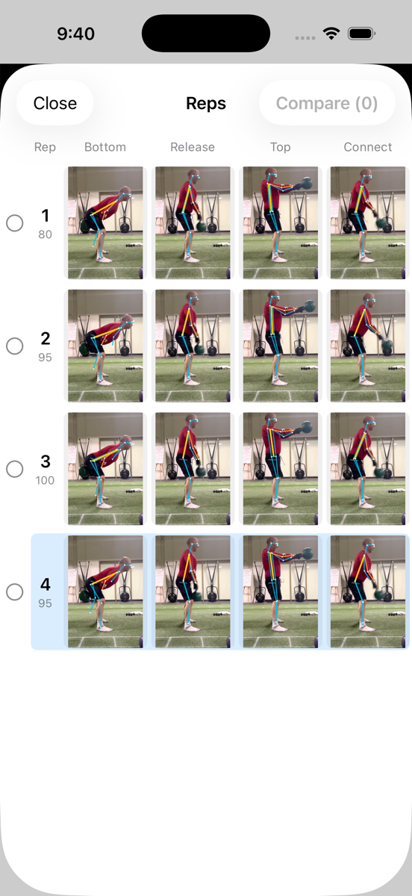
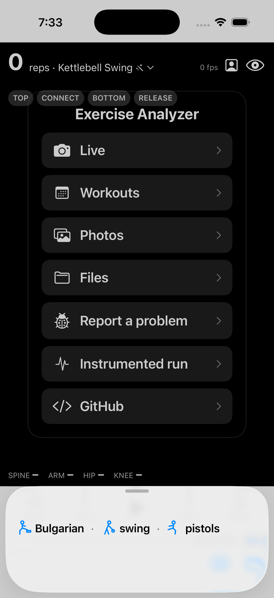
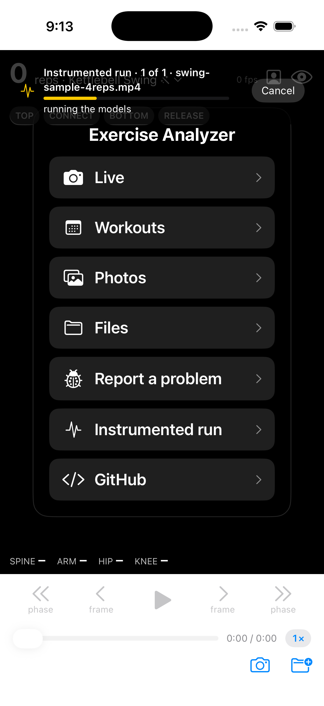
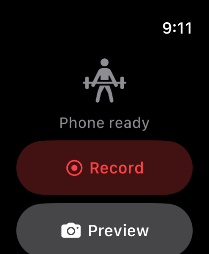
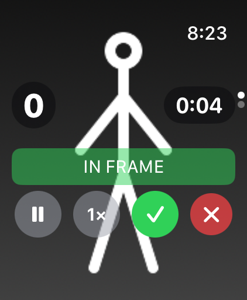
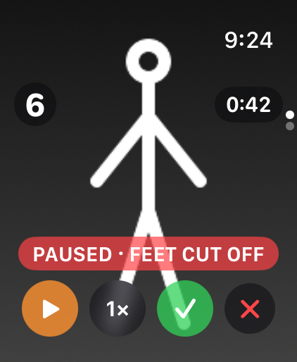
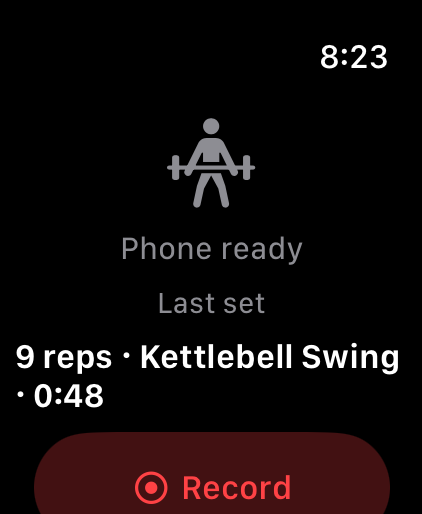
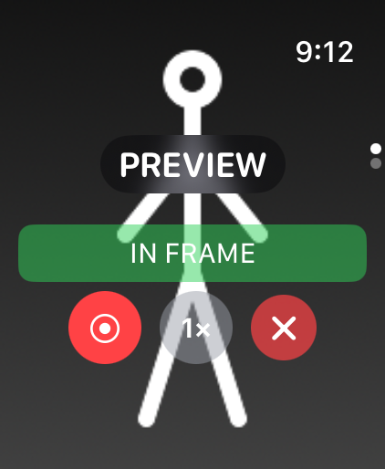
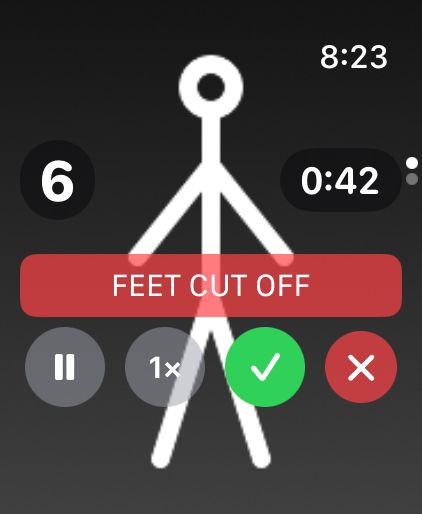

# Exercise Analyzer (iOS)

Exercise form analysis for iPhone on top of the `UltralyticsYOLO` pose model: kettlebell swings today, pistol
squats and Bulgarian split squats next. A native port of the analysis core and UX from
[idvorkin/swing-analyzer](https://github.com/idvorkin/swing-analyzer).

User stories (Cohn + Gherkin, each with its implementation status and commits): [docs/stories/](docs/stories/README.md).
How poses become phases, reps and scores, with the evidence behind every rule: [docs/analysis/](docs/analysis/README.md).

## Screenshots

| Swing analysis | Workouts |
|---|---|
|  |  |

| Bulgarian split squat | Pistol squat |
|---|---|
|  |  |

| Rep gallery, cut to the lifter | Collapsed Workouts summary | Instrumented run |
|---|---|---|
|  |  |  |

Captured from the simulator by `scripts/screenshots.sh` (sample clips, CPU inference, so the fps readout is low).

## From the wrist

| Idle | Live |
|---|---|
|  |  |

| Paused | Done |
|---|---|
|  |  |

| Preview | Recording |
|---|---|
|  |  |

The Apple Watch runs the session with the phone on a tripod. Record, cycle the camera through Front,
0.5× and 1×, and tap Done from the wrist, so a session never costs a walk back to the tripod (017). Preview
starts the camera without recording: walk over, check the in-frame bar, fix the camera, then Record from the
wrist starts the set from that moment (047). The watch shows whether
the camera sees you ("Feet cut off") and taps your wrist when you leave the picture, over a small preview
that refreshes about once a second (016). The picture fills the face with the count, the time and round
Pause, Camera, Done and Cancel buttons over it, every one whole inside the face's corners (checked on the
watch simulator before every wrist install); the watch-mode toggle sits a swipe away (042). Pause and Resume freeze the count and the elapsed time while the framing stays live,
and the paused stretch is cut out of the clip before the trim and the offline pass (040). Start a set from
the wrist and the phone follows into watch mode: giant digits readable from across the room, out by button,
double tap, hold, or the end of the set (041, 027). After Done the wrist shows the final count once the
offline pass settles it, then counts the rest up and taps at the set length (045, 046). A face complication
shows REC with a ticking timer and the count during a set, the final count after it (043). The watch never
lies about the phone: no signal for 8 s means a "not connected" screen with the last count, a backgrounded
phone means an unlock-and-open instruction instead of a dead Record button (018). One deliberate limit: no
workout session on the watch (018), so no heart rate and nothing new on wrist-down.

## What it does

- **Live camera.** Records 720p while running `yolo26n-pose` and the swing state machine live for the HUD
  (rep count, phase, spine/arm/hip/knee angles). Frames drop only if inference falls behind.
- **Done → trim → analyze.** Stops recording, trims to the span where reps happened (1 s padding), then runs an
  offline pass over every frame of the clip with `AVAssetReader`. That pass is the source of truth for reps and the
  gallery; playback replays its pose track instead of re-running inference.
- **Imported videos** (Photos, Files, or `SWING_VIDEO=/path` in the simulator) get the same offline pass on load,
  and can be trimmed to their reps with the scissors button.
- **Rep gallery.** Rows of reps × phases (bottom, release, top, connect) with skeletons; tap to seek, tap a phase
  header to zoom that column, open the grid button for the full-screen gallery with compare mode (2–4 reps).
- **Navigation.** Previous/next rep, previous/next checkpoint, frame stepping, scrubber, ¼× ½× 1× speed.
  Hold the middle of the picture for both edges' keys at once; a held key keeps firing, every half second for
  reps and positions, every tenth of a second for frames (039).
- **Rep gallery, cut to the lifter.** Every still is the me-view crop with the skeleton remapped into it; the
  whole frame stays when no person was found (006).
- **Collapsed Workouts summary.** The sheet pulled down to its handle reads the day's exercises as short words
  with a stick figure each; drag it open for the full gallery (038).
- **Lock-screen Exercise control.** One press opens the app on Live with the camera already running (044).
- **Instrumented run.** Replays the stored sets on the phone with the detector and tracker numbers in the log
  (037).
- **Bell detector, off by default.** A tracker holds the bell through the rep when it is on; the by-eye numbers
  are in [docs/analysis/kettlebell-detector.md](docs/analysis/kettlebell-detector.md) (034).
- **Save** writes the trimmed clip to Photos.

## Session log

Every launch writes JSON Lines to the app's `Documents/logs/swing-<timestamp>.jsonl`: per-frame metrics, every
phase transition, reps, detection reasons, seeks, trims, camera and watch events, and bug reports. The event
catalogue, the pull commands and the reading recipes are in [docs/DEBUGGING.md](docs/DEBUGGING.md).

## Test ladder

Cheapest rung first: `just test` (host, ~1 s, everything in `ExerciseCore` against real pose tracks),
`just analyze clip.mov` (the model plus the analyzers on the Mac, any clip, 130 fps), `just test-sim` (simulator,
minutes, the app end to end judged from its log), `just watch-screens` (watch simulator, ~1 min, every watch
page from a fixed status, judged by eye), `just run-device` (phone: camera, HDR, Photos, watch). Which kind of change is verified where, how fixtures are made, the launch hooks, and the
screenshot script are in [docs/TESTING.md](docs/TESTING.md).

## Bug reports

Shake the phone to file a report: the note, the context (clip, exercise, playhead, log file), a screenshot and the
playhead frame. `just pull-logs` brings them to the Mac and `just file-bugs` files each new one as a GitHub issue
with the images attached. The monitor loop and the whole flow: [docs/DEBUGGING.md](docs/DEBUGGING.md).

## Keypoints

The web app uses BlazePose-33; YOLO pose models emit COCO-17. Every keypoint the swing analysis needs
(shoulders, elbows, wrists, hips, knees, ankles) exists in both, so `SwingSkeleton.swift` ports the angle math
over COCO indices. Pose-track files are not interchangeable between the two apps.

## Build

```bash
just model                              # downloads yolo26n-pose.mlpackage into the app (gitignored)
just run-sim /path/to/swing.mp4         # simulator, auto-loads the video
just run-device                         # connected iPhone (needs an Apple ID signed into Xcode)
```

The `UltralyticsYOLO` package comes from `ultralytics/yolo-ios-app`, pinned by commit in the Xcode project.

Test hooks for simulator runs (no UI tapping needed): `SWING_VIDEO=/path` auto-loads a file and
`SWING_AUTO_TRIM=1` trims it right after the first analysis, and `SWING_OPEN_RECENT=1` reopens the newest Recents entry. Pass them through `simctl` as
`SIMCTL_CHILD_SWING_VIDEO` / `SIMCTL_CHILD_SWING_AUTO_TRIM`.

Sample swing videos live in
[idvorkin-ai-tools/form-analyzer-samples](https://github.com/idvorkin-ai-tools/form-analyzer-samples) as WebM;
convert for iOS with `ffmpeg -i in.webm -c:v libx264 -pix_fmt yuv420p -an out.mp4`.

## Files

| File | Role |
| --- | --- |
| `VideoPoseSession.swift` | Orchestrates sources, predictor, pipeline, recorder, trim, save, navigation, log |
| `SwingPipeline.swift` | Result → tracked person → analyzer → PoseTrack + reps; frame thumbnails |
| `KettlebellExerciseAnalyzer.swift` | Phase state machine, peaks, rep quality (port of the web analyzer) |
| `SwingSkeleton.swift` | COCO-17 angle math (port of Skeleton.ts) |
| `PoseTrack.swift` | Time-ordered analyzed frames with nearest lookup and shifting |
| `OfflineAnalyzer.swift` | AVAssetReader pass over every frame |
| `CameraSource.swift` | AVCaptureSession delivering raw 720p frames |
| `FrameRecorder.swift` | AVAssetWriter recording, trim export, save to Photos |
| `RepGalleryView.swift` | Inline gallery and full-screen sheet with compare |
| `PoseOverlayView.swift` | Shared skeleton drawing, live overlay, thumbnails |
| `SessionLog.swift` | JSON Lines logger |
