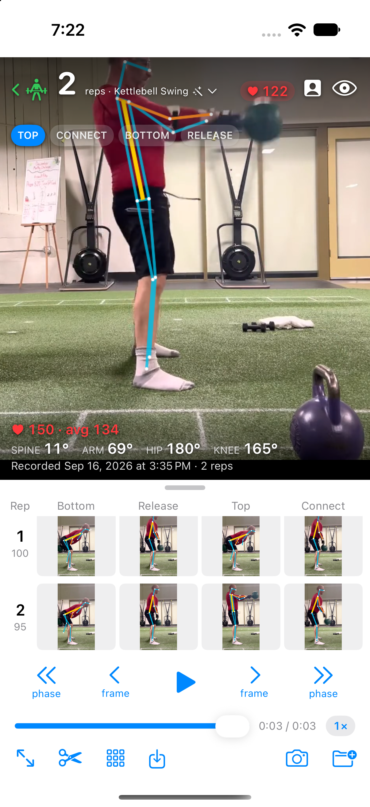
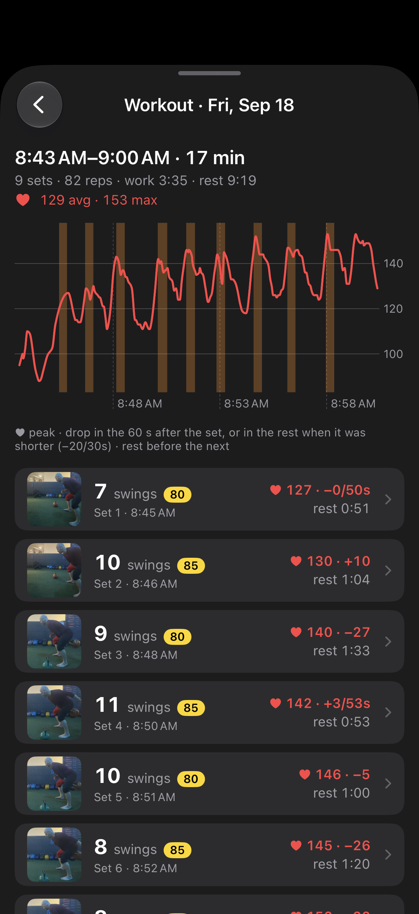
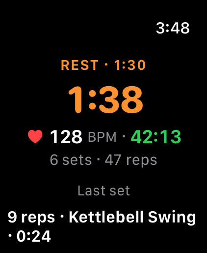
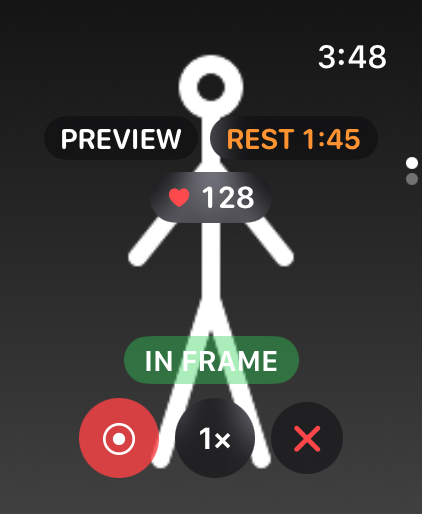

# Exercise Analyzer

**Focus on the lift. See every rep. Understand the whole workout.**

Exercise Analyzer turns your iPhone into a training partner that counts reps, breaks down your form, and
puts your sets, rest, and heart rate in one picture. Set the phone on a tripod and run the session from your
Apple Watch, or open a video you've already filmed.

**Six exercises · Form scores for every rep · Watch control · Apple Health · On-device analysis**

| See your form and effort | See your workout and recovery | Time your rest from your wrist |
|---|---|---|
|  |  |  |

*The workout timeline shows a real nine-set session. Replay and watch images are simulator captures with demo heart-rate data.*

[Explore the screenshot gallery →](docs/screenshots/README.md)

## From the first rep to the last rest

1. **Set up once.** Prop up your phone, check the camera preview on your watch, and switch lenses from where
   you'll lift. The framing indicator tells you whether you're fully in view.
2. **Lift.** Start recording from your wrist. See reps as you go, pause for an interruption, and tap Done
   when you finish. The app trims around the set and analyzes every frame for the final count and scores.
3. **Review and recover.** Find the rep you want to inspect, check your form, and glance at your rest timer
   before the next set. Start a workout on the watch to track heart rate and the whole session in Apple Health.

Your playlist keeps playing through recording and replay.

## See what happened in every rep

Was that last squat shallower? Did your lockout change as you tired? Put the same moment of every rep side
by side in the gallery, then tap a thumbnail to jump straight to it in the video.

- **Scores with reasons.** Each rep gets a 0–100 form score and feedback about what to work on.
- **Your movement, made visible.** A skeleton overlay, joint angles, and highlighted phases follow the video.
  Zoom to yourself to make the details easier to see.
- **Go straight to the moment.** Step by rep, phase, or frame with large controls. Hold the picture to bring
  navigation under your thumbs.
- **Effort alongside form.** For recordings with heart-rate data from a tracked workout, replay shows your
  heart rate at the playhead, plus the set's peak, average, and drop during rest.

## Six exercises, each with its own analysis

| Exercise | What you can inspect |
|---|---|
| Kettlebell swing | Hinge depth, knee bend, and the top of each swing |
| Pistol squat | Depth, torso lean, and the extended leg |
| Bulgarian split squat | Front-leg depth, back-knee position, and torso lean |
| Split squat | Floor-based split squats, including barbell sets |
| Turkish get-up | The journey from floor to standing and back, step by step and by arm |
| Pull-up | Hang, pull, top, and lowering, with feedback on height and arm extension |

Leave the exercise on **Auto**, or choose it yourself. Switching exercises re-reads the saved poses without
rescanning the video.

## Your session, on your wrist

Keep the phone on the tripod. **Preview, Record, Pause, Resume, and Done** are all on the watch, along with
camera switching and a tap when you drift out of frame.

Start one workout for your entire gym visit: warm-up, sets, and rests. Heart rate and elapsed time stay on
your wrist across recordings. Between sets, the rest timer takes the spotlight; it stays visible while you
frame your next shot, with a notification when your chosen rest time is up if notifications are enabled.
End the workout to save it to Apple Health as functional strength training.



*Frame the next set while keeping your rest time and heart rate in sight.*

## The whole workout in one view

See your heart-rate curve with every recorded set marked along the timeline. Tap a set's band to open its
video, then return to the workout. Each set's row brings together reps, form score, peak heart rate, rest
duration, and how far your heart rate fell afterwards.

Browse training by day and exercise, with thumbnails of the lift and totals at a glance. As the analysis
improves, stored sets refresh automatically.

## Your videos belong in your library

Open clips from **Photos or Files**, including sets you filmed before installing the app. Photos suggestions
separate **New, Analyzed, and Ignored** clips so you can pick up where you left off.

Trim around the reps without re-encoding, preserve HDR, and save clean footage without the skeleton burned
in. Replace the original in Photos when you're ready, with Undo trim available. When removing a set, the
app tells you whether its video stays in Photos or whether you're deleting the only copy kept in the app.

Pose analysis runs on your iPhone using Core ML. Your footage doesn't need to be uploaded for analysis.

## How it works

A YOLO pose model finds seventeen keypoints in every frame. Exercise-specific analyzers turn movement into
phases, reps, and scores, with rules tested against real recorded pose tracks. The live pass feeds the HUD;
the full pass over the recorded clip produces the final results.

- Feature details, implementation status, and verification: [user stories](docs/stories/README.md)
- How poses become reps and scores, one file per exercise: [docs/analysis/](docs/analysis/README.md)
- What the offline pass costs and how it is measured: [performance](docs/analysis/performance.md), and every
  precision and speed hypothesis we tried, with its numbers: [optimization](docs/analysis/optimization.md)
- Optional kettlebell tracking, off by default: [kettlebell-detector](docs/analysis/kettlebell-detector.md)
- Where the code is going and why: [docs/architecture/](docs/architecture/)

## Build and test

```bash
just model          # fetch the pose model into the app (gitignored)
just test           # host tests on real pose tracks, about a second
just build-sim      # simulator build
just test-sim       # the app end to end on the simulator, judged from its log
just watch-screens  # every watch screen from a fixed state, for your eyes
just run-device     # build, install, and launch on your iPhone
```

The test ladder, the fixtures, the simulator hooks and which change is verified where:
[docs/TESTING.md](docs/TESTING.md).
Watch installation and device setup: [device tooling](docs/DEBUGGING.md#device-tooling).

## Debugging

Every launch writes a session log to the phone. Shake to file a bug with the context attached, then
`just pull-logs` and `just file-bugs` turn the reports into GitHub issues. The event catalogue, the device
tooling and the bug monitor loop: [docs/DEBUGGING.md](docs/DEBUGGING.md).

## Layout

| Directory | What lives there |
|---|---|
| `ExerciseCore/` | The analysis package: skeleton math, analyzers, the offline pass, fixtures and tests. No UIKit. |
| `ExerciseAnalyzer/` | The iPhone app: camera, recording, playback, the HUD, the galleries, the watch bridge. |
| `ExerciseAnalyzerWatch/` | The watch app and its face complication. |
| `ExerciseAnalyzerControls/` | The lock-screen control that opens the app on Live. |
| `docs/` | Stories, analysis notes, testing and debugging guides, screenshots. |

Working on it with an agent? Start at [AGENTS.md](AGENTS.md).
