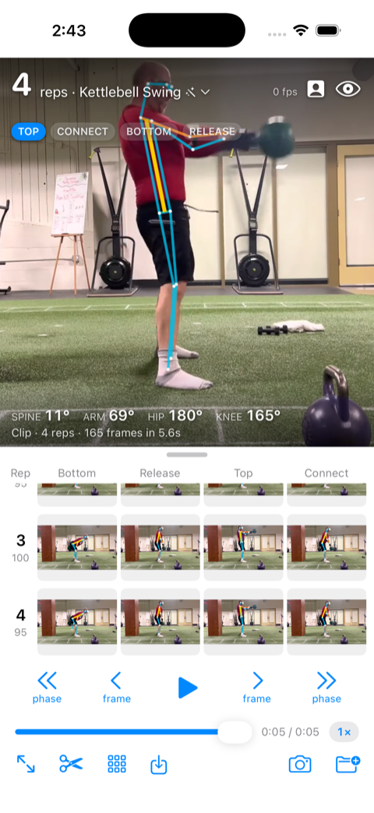
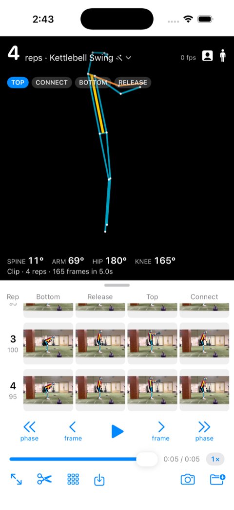
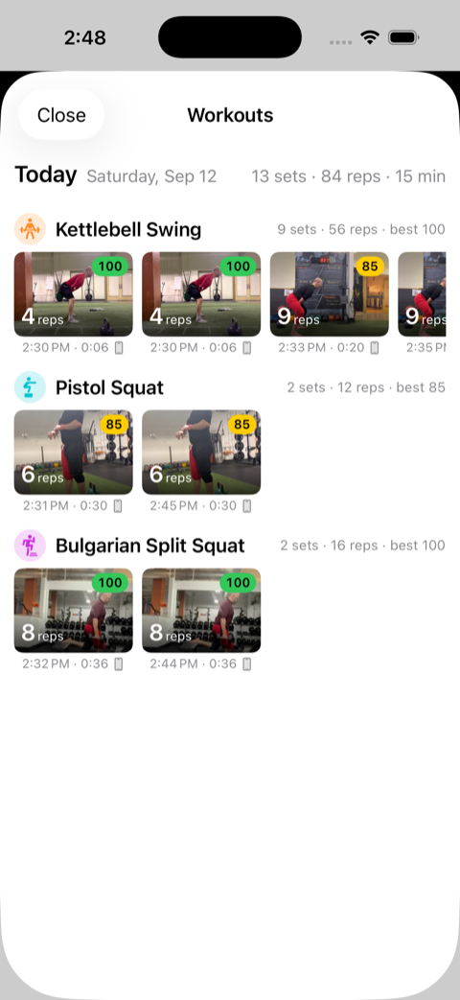
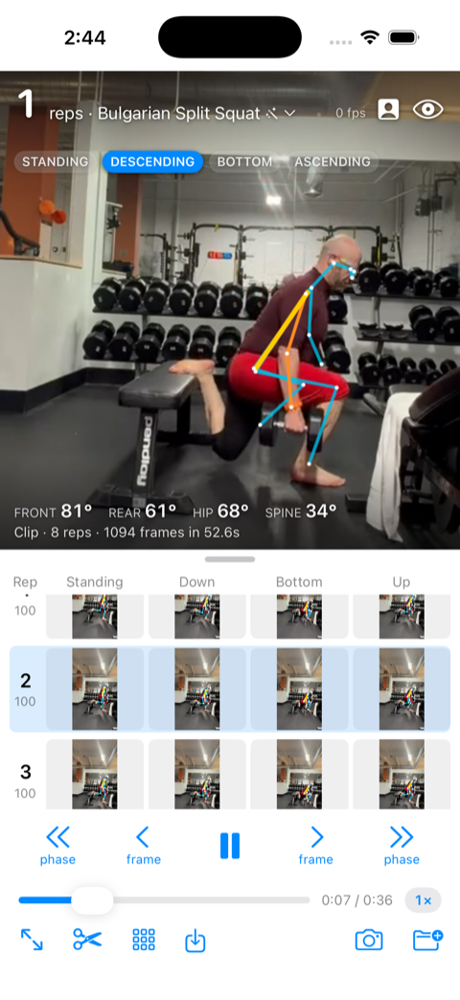
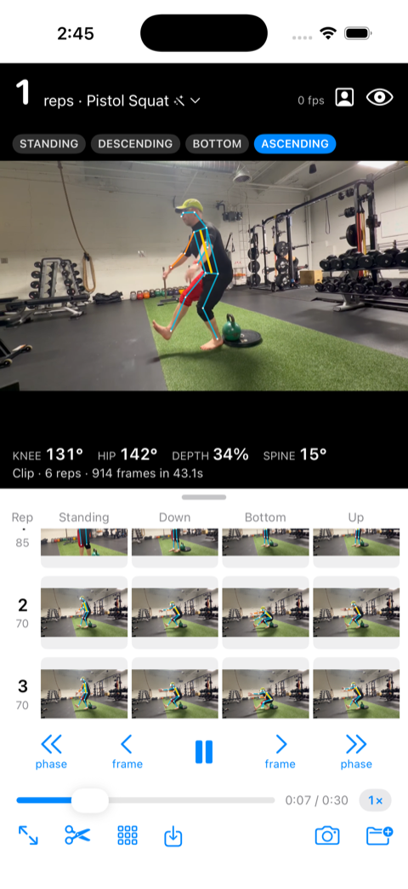

# Exercise Analyzer (iOS)

Exercise form analysis for iPhone on top of the `UltralyticsYOLO` pose model: kettlebell swings today, pistol
squats and Bulgarian split squats next. A native port of the analysis core and UX from
[idvorkin/swing-analyzer](https://github.com/idvorkin/swing-analyzer).

User stories with per-feature verification status: [docs/USER_STORIES.md](docs/USER_STORIES.md).

## Screenshots

| Swing analysis | Skeleton only | Workouts |
|---|---|---|
|  |  |  |

| Bulgarian split squat | Pistol squat |
|---|---|
|  |  |

Captured from the simulator by `scripts/screenshots.sh` (sample clips, CPU inference, so the fps readout is low).

## What it does

- **Live camera.** Records 720p while running `yolo26n-pose` and the swing state machine live for the HUD
  (rep count, phase, spine/arm/hip/knee angles). Frames drop only if inference falls behind.
- **Done → trim → analyze.** Stops recording, trims to the span where reps happened (1 s padding), then runs an
  offline pass over every frame of the clip with `AVAssetReader`. That pass is the source of truth for reps and the
  gallery; playback replays its pose track instead of re-running inference.
- **Imported videos** (Photos, Files, or `SWING_VIDEO=/path` in the simulator) get the same offline pass on load,
  and can be trimmed to their reps with the scissors button.
- **Rep gallery.** Rows of reps × phases (bottom, release, top, connect) with skeletons; tap to seek, tap a phase
  header to zoom that column, open the grid button for the full-screen gallery with compare mode (2–4 reps).
- **Navigation.** Previous/next rep, previous/next checkpoint, frame stepping, scrubber, ¼× ½× 1× speed.
- **Save** writes the trimmed clip to Photos.

## Session log

Every session writes JSON Lines to the app's `Documents/logs/swing-<timestamp>.jsonl` (visible in Finder and the
Files app). Events: `session_start`, `model_loaded`, `load`, `install_item`, `play`, `display_frame` (first few per
item), `frame` (per analyzed frame: time, src live/file/offline, infer_ms, fps, conf, phase, rep, angles), `phase`
(transitions during playback), `rep` (positions, score, feedback), `camera_start`/`camera_done`/`camera_cancel`,
`trim_start`/`trim`/`trim_done`/`trim_skipped`, `offline_pass` (frames, elapsed, fps), `detection`, `analyzed`,
`crop`, `seek` (which control asked, player time before/after), `pause`, `ui` (frame steps), `recents_saved`,
`bug_report`, `error`.

```bash
just pull-logs                 # iPhone → ~/tmp/agent/swing-logs/logs
just pull-logs-sim             # simulator → ~/tmp/agent/swing-logs/sim
just log-summary <file.jsonl>  # everything except per-frame events, plus frame count
```

## Test ladder

Cheapest rung first: `just test` (host, ~1 s, everything in `ExerciseCore` against real pose tracks),
`just test-sim` (simulator, minutes, the app end to end judged from its log), `just run-device` (phone: camera,
HDR, Photos, watch). Which kind of change is verified where, how fixtures are made, the launch hooks, and the
screenshot script are in [docs/TESTING.md](docs/TESTING.md).

## Bug reports

Shake the phone to file a report: it writes a `bug_report` event into the session log plus a line in
`Documents/bugs.jsonl` (note, clip, exercise, playhead, log file). Then:

```bash
just pull-logs   # copies logs and bugs.jsonl to ~/tmp/agent/swing-logs and prints the reports
just file-bugs   # files each new report as a GitHub issue (once; marker <!-- bug:<time> --> in the body)
```

Analysis of each report goes on its issue as a comment, with the log evidence, so regressions stay findable.

## Keypoints

The web app uses BlazePose-33; YOLO pose models emit COCO-17. Every keypoint the swing analysis needs
(shoulders, elbows, wrists, hips, knees, ankles) exists in both, so `SwingSkeleton.swift` ports the angle math
over COCO indices. Pose-track files are not interchangeable between the two apps.

## Build

```bash
just model                              # downloads yolo26n-pose.mlpackage into the app (gitignored)
just run-sim /path/to/swing.mp4         # simulator, auto-loads the video
just run-device                         # connected iPhone (needs an Apple ID signed into Xcode)
```

The `UltralyticsYOLO` package comes from `ultralytics/yolo-ios-app`, pinned by commit in the Xcode project.

Test hooks for simulator runs (no UI tapping needed): `SWING_VIDEO=/path` auto-loads a file and
`SWING_AUTO_TRIM=1` trims it right after the first analysis, and `SWING_OPEN_RECENT=1` reopens the newest Recents entry. Pass them through `simctl` as
`SIMCTL_CHILD_SWING_VIDEO` / `SIMCTL_CHILD_SWING_AUTO_TRIM`.

Sample swing videos live in
[idvorkin-ai-tools/form-analyzer-samples](https://github.com/idvorkin-ai-tools/form-analyzer-samples) as WebM;
convert for iOS with `ffmpeg -i in.webm -c:v libx264 -pix_fmt yuv420p -an out.mp4`.

## Files

| File | Role |
| --- | --- |
| `VideoPoseSession.swift` | Orchestrates sources, predictor, pipeline, recorder, trim, save, navigation, log |
| `SwingPipeline.swift` | Result → tracked person → analyzer → PoseTrack + reps; frame thumbnails |
| `KettlebellExerciseAnalyzer.swift` | Phase state machine, peaks, rep quality (port of the web analyzer) |
| `SwingSkeleton.swift` | COCO-17 angle math (port of Skeleton.ts) |
| `PoseTrack.swift` | Time-ordered analyzed frames with nearest lookup and shifting |
| `OfflineAnalyzer.swift` | AVAssetReader pass over every frame |
| `CameraSource.swift` | AVCaptureSession delivering raw 720p frames |
| `FrameRecorder.swift` | AVAssetWriter recording, trim export, save to Photos |
| `RepGalleryView.swift` | Inline gallery and full-screen sheet with compare |
| `PoseOverlayView.swift` | Shared skeleton drawing, live overlay, thumbnails |
| `SessionLog.swift` | JSON Lines logger |
