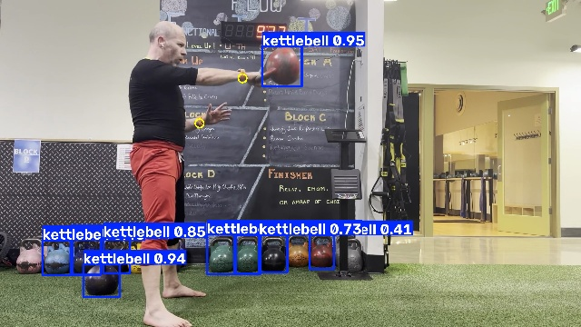
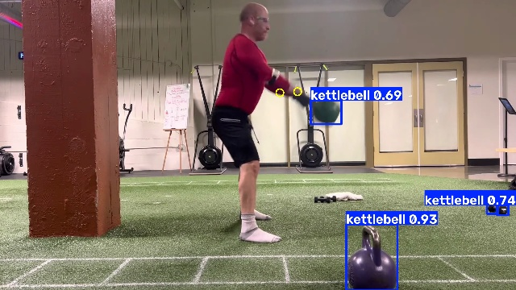
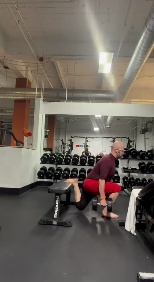
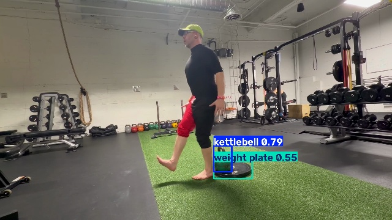

# Kettlebell detector (#18)

Can a second model see the bell? Tried on the Mac with Core ML (rung 1.5, `scripts/model-trials/`) on 2026-09-12.

## How the models relate

- The pose model (`yolo26n-pose`, 3 MB) knows one class, person, and its 17 keypoints. It cannot report a bell, and
  there is no off-the-shelf model that does pose and a kettlebell class at once: a bell needs a **second model, a
  second Core ML run per frame** on the same pixel buffer.
- COCO detectors have no kettlebell class. An **open-vocabulary detector** does: YOLO-World takes class names as
  text, and Ultralytics bakes the text embeddings in at export, so the Core ML model has a single class
  "kettlebell" and no text encoder at runtime.
- Cost per frame on the phone: the pose model runs in about 10 ms on the Neural Engine (`offline_pass`
  `avg_infer_ms`, 94 fps on a 48 s clip); the detector is the same size class, so expect the offline pass to go from
  ~94 fps to ~50 fps with both, and live analysis at 30 fps to stay comfortable. Memory: one more model in RAM.

## Trial: YOLO-World v2 (small), class "kettlebell", Core ML, 640 px

`scripts/model-trials/export_bell_detector.py world` exports `yolov8s-worldv2.mlpackage` (23 MB, fp16, NMS in the
model). `scripts/model-trials/bell_trial.py` ran it over the four sample clips at confidence ≥ 0.25; with a pose
fixture for the same clip it scores the box **nearest a wrist** (a gym has bells on the rack, all of which the
detector also finds, so "the best box" is the wrong question).

| Clip | Frames | Frames with a bell | Confidence (median, wrist-nearest box) | Box within 0.1 of a wrist | Inference (Mac) |
|---|---|---|---|---|---|
| swing-sample-4reps | 165 | 100 % | 0.78 | 52 % | 8.9 ms |
| igor-1h-swing | 593 | 100 % | 0.65 | 70 % | 8.8 ms |
| pistols (bell on the floor, none in hand) | 914 | 100 % | 0.76 | 14 % | 8.8 ms |
| bulgarian (no bell in view) | 1094 | 4 % | 0.26 | – | 8.7 ms |

### Smaller and cheaper: YOLOE nano and the small model at 320 px

Igor: use nano. YOLO-World has no nano, but YOLOE does (`yoloe-26n`, the same generation as the app's
`yolo26n-pose`); exported the same way with the prompt "kettlebell" (5.5 MB). Also the small model at 320 px, for
the cost of a lower resolution. Same trial, wrist-nearest box:

| Model, floor | swing-4reps: bell / on wrists | igor-1h-swing | pistols (floor bell) | bulgarian (no bell) | Inference (Mac) | Size |
|---|---|---|---|---|---|---|
| World small 640, 0.25 | 100 % / 52 % | 100 % / 70 % | 100 % / 14 % | 4 % | 8.9 ms | 24 MB |
| World small 320, 0.25 | 100 % / 38 % | 100 % / 36 % | 1 % | 0 % | 2.7 ms | 24 MB |
| **YOLOE nano 640, 0.25** | 100 % / **79 %** | 100 % / **70 %** | 100 % / 10 % | 86 % (median 0.30) | 7.0 ms | **5.5 MB** |
| YOLOE nano 640, 0.40 | 100 % / 61 % | 100 % / 47 % | 100 % / 9 % | 19 % (median 0.44) | 7.0 ms | 5.5 MB |

- The nano keeps the swung bell on the wrists as well as or better than the small model, at lower confidence
  (about 0.5 on the bell in hand, 0.9 on the still bells on the rack: motion blur costs it). Raising the floor to
  0.4 loses in-hand frames; better to keep 0.25 and let a **tracker** carry the bell across frames (start a track
  on a confident box near the wrists, keep it on low-confidence boxes that continue its motion).
- The nano's false positives on the bell-less clip are intermittent low-confidence boxes (none on the two frames
  rendered at 0.15); a tracker that needs a box near the wrists for several frames does not start on them.
- 320 px halves nothing that matters: the swung bell is lost far more often. Stay at 640.

**Verdict: YOLOE nano at 640, floor 0.25, with a wrist-anchored tracker.** Same model family as the pose model,
a fifth of the small model's size, and the in-hand bell is found at least as often.

What the numbers say (small model, first trial):

- **It sees the bell.** Every frame of both swing clips has a kettlebell box, the swung bell reads 0.65–0.95 at the
  top and 0.69 at the hinge, and it lands on the wrists in 52–70 % of frames. The misses are mostly the hinge, where
  the bell hangs between the legs and the box nearest the wrists is a rack bell; a tracker that follows the box from
  frame to frame (the bell that moves with the wrists) would resolve those.
- **It is honest about absence**: the split-squat clip, with no bell in view, gets a box in 4 % of frames at 0.26.
- **Rack bells are the noise**, not false positives: they are real bells. Picking the box by wrist distance (or by
  motion) is the whole disambiguation.
- Inference on the Mac is 9 ms; the phone's Neural Engine is the real measure and is not yet taken.

## 2026-09-12: plumbing built (step 1)

- `BellDetector` (ExerciseCore, Vision) runs the nano on a frame and parses its end-to-end output itself: the
  export is a segmentation model, so each row is [x1, y1, x2, y2, conf, class, 32 mask coefficients] in the 640 px
  letterboxed input plus a mask prototype tensor; the Ultralytics SDK's detector expects six columns and cannot
  read it. Rows map back with the pose model's letterbox math. The mask outputs are computed and thrown away: a
  detect-only export would be cheaper and is the first thing to try if the phone's cost is high.
- `BellSighting` per frame (box, confidence, mean colour of the box's middle via `CIAreaAverage`), stored in the
  track and in fixtures; `BellTracker` in the pipeline picks the bell in play (starts on a box ≥ 0.5 within 0.12 of
  a wrist, follows within 0.1 at ≥ 0.25, lost after 10 unseen frames); `BellColor.weightKg` maps a vivid hue to
  the competition code. `BellTests` cover the tracker and the colours.
- The app runs it in the offline pass only and logs `bell_frames`, `bell_avg_infer_ms`, `bell_seen` in
  `offline_pass`; a dot in the bell's colour rides on the tracked bell in playback. `posetrack` runs it on the Mac
  and `--poses-from` adds bells to a fixture without touching its poses: the four sample fixtures now carry bells.
- Mac, 4-rep clip: bell in play in 87 % of frames; the pass went from 60 to 40 fps with the detector (release
  build, Vision on the Mac's GPU/ANE). Simulator (CPU): pose 27 ms, detector 74 ms per frame, 9 fps for the pass.
  Phone cost (IMG_4342, 3989 frames): 91 s at 43.7 fps with the detector at 12 ms a frame, memory flat at
  73 MB, the bell seen in 2962 frames. Commit 3b997e1.

## 2026-09-12: other equipment (dumbbells, barbells, bench) with the same nano

Igor: can it extract dumbbells and barbells too, and whatever helps the Bulgarian split squat? With YOLOE the
classes are text prompts fixed at export, so a wider vocabulary costs nothing per frame. Exported the nano with
"kettlebell, dumbbell, barbell, weight plate, bench, plyo box" (`export_bell_detector.py yoloe 26n 640
kettlebell,dumbbell,barbell,weight plate,bench,plyo box`) and ran `equipment_trial.py`:

| Clip | kettlebell | dumbbell | barbell | weight plate | bench | plyo box |
|---|---|---|---|---|---|---|
| swing-4reps | 100 % (0.54) | – | – | – | – | – |
| igor-1h-swing | 100 % (0.91) | – | – | – | – | – |
| pistols | 100 % (0.77) | – | – | 65 % (0.47) | – | – |
| bulgarian | 86 % (0.34) | – | – | – | – | – |

- The kettlebell class is as good as in the single-class export (better on the one-hand clip), so a wider
  vocabulary does not cost the bell anything.
- The other classes did not deliver on these clips: the Bulgarian clip (464 × 848, dim) has a bench under the rear
  foot and a dumbbell rack in the background and the nano found neither, even at 0.15; "weight plate" in the pistol
  clip is the kettlebell's handle, while the real plates on the wall rack are missed. No clip has a dumbbell or a
  barbell in hand, so the in-hand case is untested.
- Decision: the bundled model stays single-class kettlebell for now. To revisit: record one Bulgarian set with a
  dumbbell in each hand and the bench in frame at full resolution, then try the nano and the small (`26s`) with
  those prompts on it. If dumbbells in hand detect, the tracker generalises to "the weight that moves with the
  wrists" and the bench becomes a second signal for the split-squat detector (rear foot on a bench).

## 2026-09-12: the first phone run crashed; three exports of one checkpoint (#43)

The first re-run of a stored get-up from its video crashed the app (the log stops after `recents_rerun`), and the
Mac reproduced it on the same clip (exported from Photos with `osascript`): `EXC_BAD_ACCESS` in `memmove` on
Vision's transformer queue at frame 398, every run, stack not unwindable. Pose-only ran the whole clip at 124 fps.
Isolation by switches in `posetrack`: colour sampling off, copied sample buffers, detector on CPU: still crashes;
detector on GPU: runs, and Core ML prints "Invalid blob shape: data-dependent shapes were disabled: gather_nd". A
half-second cut around frame 398 and a blank clip both run clean, so the trigger is runtime state after hundreds of
frames of varying output sizes, not one frame's content.

What the Ultralytics exporter does with `nms` for a YOLO26 checkpoint, which carries two heads:

| `export(nms=…)` | Graph | Output | Verdict |
|---|---|---|---|
| `True` | dense one-to-many head + an NMS op traced into the graph | rows per frame vary | the crash above; GPU refuses it |
| `False` | the end-to-end one-to-one head with top-300 | `[1, 300, 38]`, static | static, but this head scores the blurred bell in hand at 0.08 where the dense head says 0.39 |
| `None` | dense one-to-many head, no NMS op | `[1, 37, 8400]` (4 box, 1 score, 32 mask coefficients), static | **bundled**: `BellDetector.parseDense` decodes it and suppresses overlaps in Swift |

Also found on the way: the phone's Neural Engine hands the output back as Float16 while the Mac gives Float32;
`BellDetector` now reads by data type (`BellDetectorParseTests`). And a self-inflicted detour: a second export
moved *into* the first package's folder instead of replacing it, so one run loaded the old model.

### The phone, after the export fix: two more leaks and two more stops

- The dense-model build still died within a second of the pass, with no signal caught and no MetricKit report: a
  kill from outside the process. `offline_progress` (memory every 60 frames) settled it: 132 MB at frame 1, 3367 MB
  at frame 421 with 9 MB left. Nine MB a frame is one 1080 × 1920 BGRA frame: `CIImage(cvPixelBuffer:)` +
  `CIAreaAverage` on a shared `CIContext` kept every frame alive on iOS (the Mac peaked at 229 MB). The sampler
  reads the BGRA bytes now.
- Then ~1.4 MB a frame: Vision's observations and the two output tensors are autoreleased and a detached loop never
  drains its pool; `autoreleasepool` per frame. Flat at 73 MB from then on.
- "Model not ready": a set opened in the first second after launch reached the pass before the model loaded (#45);
  the pass waits up to 10 s.
- "Operation Interrupted" at 43 s: auto-lock backgrounded the app mid-pass and AVFoundation stopped the reader
  (#46); the pass holds the idle timer like recording does.

Phone, IMG_4342 (3989 frames), untouched: 91.3 s at 43.7 fps, pose 10.7 ms, detector 12.0 ms, decode 0.35 ms per
frame, footprint 73 MB flat, bell in 2962 frames, 2 reps. Before the detector the same pass ran at ~94 fps: the
second model is the whole cost; decoding is free. Levers, Igor's first: detector only inside the padded rep span
the pose pass finds (this clip ~57 % of frames, saves ~20 s of 91); every second frame with the tracker bridging
(~24 s); a detect-only export without the mask branch (untested).

Tracker after the study (`BellTests`): a box still within 0.02 for 90 frames is a bell at rest, and so is any box
in a grid cell that holds a bell in 60 % of the clip's frames (known before an offline analysis; 30 % caught a
swung bell's own apex); neither is started on or followed. Following also requires the box within 0.2 of a visible
wrist (the bell in play is in the hands by definition) and a colour within 60° of hue of the tracked bell when
both are vivid (45° flipped a dark red bell between orange and yellow readings under gym light). Measured with the
wrist gate off, half the "tracked" frames on the swing clips sat 0.2 or more from any wrist: rack bells, which had
padded the earlier percentages. With the dense head and the gates:

| Clip | Bell in play | Count |
|---|---|---|
| swing-4reps | 83 % | 4 |
| igor-1h-swing | 62 % (28 kg by colour) | 9 |
| pistols (floor bell) | 1 % | 6 |
| bulgarian | 6 % | 8 |
| tgu-phone-2min (IMG_4342) | 47 % (28 kg by colour) | 2 |

Compute plan on the Mac (`POSETRACK_PLAN=1`): pose model 303 ops on the Neural Engine, 19 CPU; detector 316
and 2; the rest are constants. The phone logs the same as `model_plan` (#44).

## 2026-09-12: parked

Igor: "a lot of fun, but it didn't really make anything particularly better; disable it for now and get the speed
back." The detector stays bundled and the code stays, off by default (`model_skipped` in the log); `SWING_BELLS=1`
or the `bellDetector` user default turns it on for a trial. Sets analyzed with it keep their bells (a build that
runs fewer models does not re-run them). The pass is back at ~94 fps. What would make it worth turning on is the
plan below: the swing on the bell's path and the get-up's stacking, neither built.

## 2026-09-12 night: the bell in (nearly) every frame it is in the hands (#18)

Igor: get the bell in every frame on the swing and get-up clips, controls (pistols with a floor bell, a
Bulgarian with no bell in view) staying near zero. The lab ran on the Mac with Muse doing the grinding; the
notebook with every hypothesis and result is `~/tmp/agent/notes/2026-09-12-bell-lab-notebook.md`.

**Two questions, measured apart.** For frames with a visible wrist: did the detector put any box within 0.2 of
it (*seen*), and did the tracker report a bell there (*held*). `100 − seen` is the detector's ceiling, the gap is
the tracker's loss. posetrack prints both; the tracker questions then ran on stored fixtures through the real
`BellTracker` in under a second (`TuningReports.testBellTrackerHeldPerFixture` is the durable form), with each
lost frame classed as detector-blind, suppressed as furniture, no confident box to start on, a box too far from
the wrist to start, a gap with no box in reach, or a box in reach refused by a rule.

**Where the frames went (nano 640, floor 0.25, the old tracker):** swings lost most to gaps the detector
left and to the swung bell passing through the floor bell's static cell at the bottom of every hinge; the
get-up lost 18 points to starts (no box at 0.4 while dead, or a good box just outside 0.12 of the wrist) and to
following (the overhead bell reads 0.15–0.25 for whole phases and the follow gate was 0.25).

**What moved the number, in order found** (held %, 4reps / 1h / TGU / pistols / bulgarian, floor 0.15 for the
rows that need it, the 1h clip with a 12-box cap):

| change | 4reps | 1h | TGU | pistols | bulgarian |
|---|---|---|---|---|---|
| old tracker, floor 0.25, cap 6 | 67 | 58 | 47 | 1 | 2 |
| lostAfter 30 + startDistance 0.15 | 67 | 68 | 56 | 1 | 7 |
| + static zones gate starts only | 81 | 69 | 56 | 1 | 2 |
| + followConf 0.15 (floor 0.15) | 96 | 69 | 76 | 1 | 13 |
| + coast 3 frames on the last velocity | 98 | 87 | 80 | 2 | 20 |
| + cap 12 (the 1h gym rack holds more than six confident bells) | 98 | 92 | 80 | 2 | 20 |
| + no start on a flat box under 0.2 of the person's height | 98 | 92 | 80 | 2 | **0** |
| **posetrack on the clips, shipped defaults** | **99** | **93** | **78** | **4** | **0** |

Rejected, with the numbers that rejected them: `startConf` 0.3 (TGU +9 but the Bulgarian 4→21: rack junk
at 0.3–0.4 next to hanging hands; the start gate is what keeps a bell-less clip clean); `stillFrames` 150
(nothing); a wider `stillRadius` (nothing on the Bulgarian, TGU −10: the overhead hold reads as furniture);
predictive follow from the last velocity (1h +3 frames, Bulgarian +2); reporting a track only once it has moved
(the Bulgarian's phantoms wander past 0.05 anyway, the 1h loses 26 points at the slow top of every swing);
coasting 10 frames (the carried box drifts, 4reps 98→83); `followDistance` 0.15 (1h +3, Bulgarian +3).
The Bulgarian phantoms were separated by shape, not place: they start as wide boxes (aspect 1.2–2.3) under
0.19 of the person's height, swing bells are tall (aspect ≤ 0.81), get-up bells are wide but big.

**Models and input sizes** (seen / held with the new tracker): nano at 960 sees the small get-up bell in 94 %
of frames (held 81) but only 41 % of the one-hand swing and holds a phantom in 89 % of the Bulgarian; 26s at
640 holds one in 92 %; 26s at 960 holds the pistols' floor bell in 72 %. Nano at 640 stays. A second package
at 960 for get-ups only was the one thing left on the table, and the blind frames say no: of the TGU clip's
604 blind hand frames, 429 are the setup, the rest between reps and the walk-off (the bell on the floor, which
the tracker must refuse anyway), rep 2 is 96 % seen at 640, and with the full gates 960 holds 81 % to 640's
80 %. The one-hand swing's 47 blind frames are all short mid-transit blurs in the centre of the frame (never
the apex, never an edge), which coasting already covers.

**Also learned:** the detector floor never changed *held* on its own (every gate sat above it), it only
relabels the loss; lowering it to 0.15 matters only because `followConf` now sits there. The 1h clip's colour
vote moved from 28 kg to 16 kg with the fuller track: Igor knows which bell that was.

Shipped: `BellTracker.Thresholds` startDistance 0.15, followConf 0.15, lostAfter 30, coastFrames 3,
flatStartMaxHeight 0.2 (zones veto starts only); `BellDetector` minConfidence 0.15, maxSightings 12;
AnalysisVersion 2026-09-12.9. Verified on the host (`BellTests`, the report) and the Mac model rung (the
table's last row); the phone is Igor's.

**Second opinions (Igor: "spin up other models and have them come up with different hypotheses").** Codex on
gpt-6-astra, in its own worktree with the same brief and without the notebook, pre-registered six hypotheses
and tested three (its notes: `~/tmp/agent/notes/2026-09-13-bell-lab-second-opinion-codex.md`). Two shipped:

- **A backward pass fills the frames before each confident start.** The offline pass knows the future: the
  same tracker run in reverse over the stored track, writing only frames the forward pass left empty and only
  boxes the detector produced (never a carried one). One-hand swing held 92→98 (24 of the 34 recovered frames
  inside reps), 4reps 99→100, TGU 78→82 (all outside reps: the bell picked up and put down), pistols +8 frames
  (4 %), Bulgarian 0. `BellTracker.filledBackward`, called from `AnalysisPipeline.analyze`.
- **The tracker sees empty frames.** The pipeline skipped the tracker on frames with no sighting, so a track
  neither aged nor coasted through them. Fixed; TGU 77→78.

**Ground truth caught a fake gain.** Cutting sampled frames with the tracker's bell drawn in (lab script
`cut-dot-frames.sh` over the report's `BELL_LAB_DOTS=1` dump) showed the circle on the ski-erg wheel behind the
lifter in the 4-rep clip and on a green rack bell in the one-hand clip, both within 0.2 of a wrist and so
scored "held". The report now prints `inZone`, held frames whose bell sits in a furniture cell: 72 of 165 and
76 of 594. The cause was the rule above that let a follow enter a furniture cell (its "+15 on the 4-rep swing"
was the wheel); restored: furniture cells veto follows as well as starts, and with the follow gate, coasting
and the backward fill in place the honest numbers are 4reps 98, 1h 98, TGU 82, pistols 4, Bulgarian 0 with
inZone 5 / 0 / 0 / 0 / 0. The second Fable instance reached the same warning independently: a box placed near
the wrist by a rule is scored by the rule that placed it; against a crop-detector reference its carried boxes
were off by 0.13 of the frame at the median.

**By eye (Muse, 95 sampled frames, the same frames before and after the fix; recall = frames with the bell in
the hands where the circle sits on it):** 4-rep swing 0.40→0.60 (false holds 6→4: the flywheel gone, the rest
circles shifted off the bell), one-hand swing 0.60→0.72 (8→4: the rack grabs gone; one coasted box on a knee,
two on the floor bell at setup), get-up 0.76→0.76 (7 unchanged: the floor bell at setup twice, the lifter's
head twice, the chest while the bell is clutched to it three times), pistols and Bulgarian 0 false holds in 20
frames. So the proxy's 98 % on the swings is a 0.6–0.7 by eye; what remains between them is mostly carried
boxes drifting off the bell during a blink and strict grading of near-misses. Next branch of the tree: coasting
itself (fewer carried frames, drawn only where the bell can be), then the get-up's head and chest classes.
**The get-up's head and chest classes (shipped after a proper sample).** Two rules from Muse's frame-by-frame
reading of the false holds: a box containing a visible head keypoint is never the bell (start or follow), and
of several boxes in reach the one nearest a visible wrist wins (nearest the last position only with no wrist
in view). On ten frames the regrade was too noisy to judge and the rules were reverted once; on a proper sample
of 58 rest-phase get-up frames (the bell clutched to the chest between reps) they cut the false holds from 25
to 7 with the circle-on-bell count unchanged at 16 of 40, and 40 more one-hand frames moved inside noise
(28 of 37 on the bell, 11 false against 10). The proxy reads it as a loss, whole-clip get-up 82→61 with inside
reps unchanged at 91, because those 21 points were false holds near a wrist. Swings and controls unchanged.
AnalysisVersion 2026-09-12.12.

**A hand-centred crop pass, tried and rejected (03:00).** The second Fable's idea: run the same nano again on a
0.3-frame square around each wrist, so the small far get-up bell is three times the pixels; crop boxes may be
followed but never start a track. On the Mac (posetrack `POSETRACK_CROP`, fixtures with the poses kept): the
detector sees the get-up bell at the hands in 90 % of frames instead of 83, held inside reps 91→93, swings and
the Bulgarian unchanged, and the **pistols go from 4 % to 87 %**: once any track exists (the floor bell's 37
frames), the crop finds a "bell" at the hands in 81 % of frames and the follow gate takes them. A crop is a
phantom machine for a live track; it needs an identity gate (the tracked bell's size and colour) before it can
be used, and two points on the get-up do not pay for that. The code is not in the tree; the notebook keeps it.

**What the improvements cost.** On the Mac, the one-hand clip three runs each: no detector 6.1 s (98 fps);
detector at the old settings (floor 0.25, six boxes) 11.8–12.2 s (49–50 fps); at the shipped settings (floor
0.15, twelve boxes) 12.2–12.4 s (48 fps). The detector halves the pass as before; tonight's settings add about
3 %; the tracker, the backward pass and the colour samples do not register: a `sample` of posetrack shows the
process waiting on the Neural Engine, then vImage converting the 1080p frame to each model's planar float input
(twice a frame, once per model), then BNNS. The phone's number came from the instrumented run (story 037):
35–41 fps sequential with the detector at 12.5–15 ms, against 43.7 fps before tonight, so the settings cost
nothing there either.

**Both models at once (Igor: "could we run both image models at once?").** The detector on a second thread
while the pose model runs, both reading the same frame: on the Mac 60→85 fps on the one-hand clip, and on the
phone, the same eight sets minutes apart, **38.6→77.1 fps** (65–87 per set), pose 9–12 ms and detector 11–15 ms
overlapping, memory 52 MB, thermal nominal. The pass with the detector now runs at nearly the detector-off
speed. `OfflineAnalyzer.extract` and posetrack (`POSETRACK_PARALLEL=1` for the sequential comparison). The
tracker's result is unchanged (held 98 % on the one-hand clip either way).
Tooling: `scripts/model-trials/cut-dot-frames.sh` and `grade-dots.sh` (docs/TESTING.md).

Coasting, by eye: the same 35 swing frames with 0, 1 and 3 coasted frames grade 17/23, 15/22 and 17/24 on the
one-hand clip and 7/9, 8/10 and 8/8 on the 4-rep clip, inside the grader's own noise (its count of frames with
the bell in hand moves by one or two between runs of identical frames), while the proxy prefers 3 by 7 to 21
points. 3 stays. The one-hand clip's remaining "floor bell" holds are the backward pass drawing the dot on the
bell during the pick-up: the right bell, not yet in the hands. Headless Muse and the interactive Muse's
sub-agents agree within two frames per clip.

Rejected by its own numbers: classifying box shape in source pixels instead of normalized units (Bulgarian
0→19, the gate is a camera-calibrated classifier, not geometry), and seeding a start from a sustained overhead
arm (no recoverable gap has such a box). Its untested ideas, worth a later round: bridge a gap by the bell's
learned offset from the wrist rather than by velocity (a hinge can turn mid-gap); learn the tracked bell's size
relative to the forearm as identity. Its inside-reps view of the metric is the better one for the get-up: held
within detected reps is 89 %, the rest of the loss is the bell on the floor. AnalysisVersion 2026-09-12.10.

**A replay kept the stored bell (#49, 2026-09-13).** Codex's architecture review read `extracted.bell ??
bellTracker.track(...)` in `AnalysisPipeline.process`: a stored frame's own `bell` won over the tracker, so a
replay of a stored set (a version bump, a mode change, the launch refresh without the clip) never re-ran the
tracker; only a model-set change, which is a pass from the clip, did. Every tracker change above reached the
phone only because the detector's model name changed the same night. Now `analyze(frames:)` always tracks from
the raw `bells` and only `restored(frames:reps:)` keeps a stored bell (`BellTests`, host). AnalysisVersion
2026-09-13.1, so every stored set replays once.

**Igor's 13-rep swing by eye (2026-09-13, the first real-gym clip on the Mac).** The phone's set replays
identically on the Mac with its poses kept (held 55 %, inside reps 45 %; phone 58 / 48). Thirty seeded frames
graded by Muse: of 25 with the bell in his hands the circle is on it in **7**, on a rack or floor bell in 8 and
absent in 9; three of four empty-hand frames carry a circle on a rack bell. Recall 28 %, precision 37 %,
against a proxy of 55 %. The fixture says why: 11.9 boxes a frame and **853 of 940 frames at the detector's cap
of 12**. The cap was set on the 4-rep sample clip with three bells in view; this gym has more than twelve, so
the swung bell, blurred at speed, is crowded out (no sighting in 155 frames) and two floor-lineup bells seen in
only a quarter of frames never become furniture and take starts.

| 13-rep swing | proxy held | inside reps | blind frames | circle on his bell (of 25) | false circles (of 30) |
|---|---|---|---|---|---|
| cap 12 (shipped) | 55 % | 45 % | 155 | 7 | 11 |
| cap 30 | 67 % | 61 % | 43 | **14** | 12 |
| cap 30 + furniture veto one cell wider, starts only | 62 % | 50 % | 41 | 13 | 9 |

The cap is the lever: every swing frame that had no circle has one at 30. The false circles are two things
the cap does not touch: one floor box at (0.58, 0.71), 0.036 × 0.080, seen in 25 % of the clip and never
anywhere else (hidden whenever Igor is in front of it; it never reaches the 0.6 share that makes a cell
furniture, and the track starts on it during the walk-in), and rack-bell starts one cell from a furniture cell
(the grid veto has no margin for a 0.09-tall bell's jitter). Widening the veto to the 3 × 3 neighbourhood for
follows too cost the 4-rep clip 17 points (the swung bell passes within a cell of the ski-erg wheel) and the
13-rep clip 13 (the hinge bottom is one cell from the lineup row); for starts only it was a wash by eye
(13 vs 14 right, 9 vs 12 false, inside the grader's noise) and was not shipped. Next, in order: a cap that
keeps the twelve by confidence and adds any box within reach of a wrist (30 everywhere costs memory and a
colour sample per box); furniture from any 3 s window a box sits still in, not 60 % of the clip (the walk-in
box); size identity for the rack bell beside the hinge (0.043 × 0.09 against 0.037 × 0.049). Lab record:
[lab/2026-09-12-bell-lab-notebook.md](lab/2026-09-12-bell-lab-notebook.md), H26–H28.

**Room for a box at the hands (H26, #18, shipped as the default).** The cap keeps the twelve by
confidence, then adds any remaining box above the floor whose centre is within 0.2 of a visible wrist
(the tracker's `handDistance`), up to 4 extra: `BellDetector.select` (pure, host-covered), `detect`
taking the frame's wrists, `maxSightings` 12, `handExtra` 4, `handReach` 0.2. The detector's model name
is now `yoloe-26n-kettlebell@0.15x12+4`, so every stored set re-runs through the models once; the same
rule runs in posetrack (sequential: same-frame wrists; `POSETRACK_PARALLEL=1`: previous frame's, the
overlap stays). The app keeps the overlap too (3ba7902 stays): the bell runs on its second thread with
the previous frame's wrists — one frame of lag at 30+ fps is far under the 0.2 reach — so the phone's
pass should hold its 77 fps; the instrumented run confirms. Prediction before the Mac run: blind frames
155 → under 60, by-eye circles on his
bell 7 → ~14, false circles unchanged (they are H27/H25: the walk-in box and the rack bell), repo
fixtures (4reps, 1h, TGU, pistols, Bulgarian) unchanged within a point — their clips never reach the
cap. AnalysisVersion 2026-09-13.4 (shared with the get-up's floor stage). **Measured (Mac, the 13-rep
clip with the phone's poses kept, the same 30 frames graded by Muse):** the reserve reproduces the cap-30
result exactly at 12 + 4: seen 75 → 90 %, held 55 → 67 %, inside reps 45 → 61 %, blind frames 155 → 43, zone
loss 157 → 121. By eye, circles on Igor's bell 7 → 12 of the graded in-hands frames (three frames came back
ungraded from a Muse transport error; cap 30 had 14 of 25), misses 9 → 2, false circles 11 → 12, as predicted.
The cap prediction held; the false circles are the walk-in box and the rack bell beside the hinge (H27, H25).
Repo fixtures unchanged (their stored sightings never reached the cap).

**Live bells while recording (#69).** Igor: "can I run both models while recording?" The live ingest
runs the detector on the same buffer on its own queue overlapping pose, with the previous frame's
wrists for the reserve (as the offline overlap), behind the detector switch plus a `liveBells` default
(`SWING_LIVE_BELLS=1`), off by default; the sightings go to `pipeline.process` so the tracker runs live
and the dot shows in the preview and the recording's HUD. One frame in flight stays one in flight: past
a 20 ms wait the frame goes without bells (`live_bells_dropped` in `camera_done`, with `live_bell_frames`,
`live_bell_avg_infer_ms` and `live_fps`). The recording is still trimmed and analyzed by the offline pass
afterwards, so stored sets are untouched (no version bump, no model-name change). Prediction: live holds
30 fps with the switch on (pose ~10 ms and detector 11–15 ms overlapped fit the 33 ms budget, as the
offline overlap held 77 fps); numbers pending the phone.

**Furniture from any window a box sits still in (H27, #18, rejected).** A cell is
furniture if it holds a box in ≥ 60 % of the frames of *some* 3 s window, not only 60 % of the whole clip
(union of both, `BellTracker.staticZones(..., window: 3.0)`, time-based so any frame rate works): the walk-in
floor box at (0.58, 0.71) sits still for the whole walk-in but never reaches the whole-clip share. Risks,
with the answers: (a) the set's own bell in a long walk-in — the pick-up frames zone too, the start lands a
frame later once it leaves the cell (today's "right bell, not yet in the hands" stretched by a frame, and the
backward fill stays out of zones); (b) a get-up's bell resting between reps — `stillFrames` already vetoes 3 s
of stillness, so no new loss expected; (c) the one-hand apex, 24 % of its clip — covered by a host test that 5
frames of every 40 never zones. Prediction before the replay: 13-rep inZone/zone up by the walk-in frames,
held and inReps unchanged or up, 4reps/1h/TGU/pistols/Bulgarian within a point; by eye false circles 12 → ~7
with recall 12 → 12. **Result, rejected.** Replay: 13-rep held 67 → **51** %, inReps 61 → 59, zone
121 → **254**; TGU held 61 → **57**, inReps 91 → 89, zone 0 → **426** (the resting get-up bell is zoned);
4reps and 1h unchanged. By eye on the same 30 frames: circles on his bell 12 → 10, misses 2 → 6, false
circles 12 → 9. The window zones the swung bell's own cells and the get-up's floor rests, so the recall
loss outweighs the false circles it removes. Reverted (the rule and its tests are gone; this entry stays as
the record). No version bump — nothing shipped.

## Plan (offline only; live and the watch unchanged)

1. **Plumbing**: YOLOE nano in the offline pass, a `bell` box per frame in the pose track (fixtures gain a field),
   the in-hand tracker (the box that moves with the wrists), a bell dot on the video, `posetrack` runs the detector
   too so fixtures come with bells, and `avg_infer_ms` for the second model from the phone's `offline_pass`. Also
   the bell's **colour** from the pixels inside the box (median hue, saturation, value): competition bells are
   colour-coded by weight (8 kg pink, 12 blue, 16 yellow, 20 purple, 24 green, 28 orange, 32 red, 36 lilac, 40
   white, 44 silver, 48 gold), so a coloured bell maps to a weight; a cast-iron bell reads black and gets no
   weight. Igor's bells in the sample clips are dark, so the mapping needs a coloured bell on the phone to verify.
2. **Swing v2**: bottom and top from the bell's path, a rep needs the bell in the hands and real travel (walk-in,
   pick-up and park fall out), apex height and float at the top as metrics; arm thresholds become quality only.
3. **Get-up v2**: bell-over-shoulder offset per stage, bell stillness through the transitions, bell overhead the
   whole rep, side from the bell.
