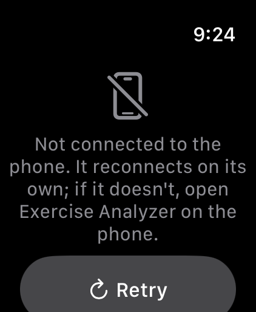
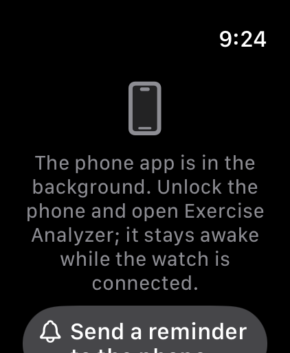

# Screenshots

Every screen of the phone app and the watch app. The phone set comes from `just screenshots` (sample clips
on the simulator, CPU inference, so the fps readout reads low). The watch set comes from
`just watch-screens "Apple Watch Ultra 3 (49mm)"`: every state rendered from a fixed status, in the order of
the control inventory in [../stories/05-watch.md](../stories/05-watch.md).

## Phone

| Swing analysis | Workouts |
|---|---|
|  |  |

| Bulgarian split squat | Pistol squat |
|---|---|
|  |  |

| Rep gallery, cut to the lifter | Collapsed Workouts summary | Instrumented run |
|---|---|---|
|  |  |  |

## Watch

| Disconnected | Phone in the background |
|---|---|
|  |  |

| Idle | Preview |
|---|---|
|  |  |

| Live | Recording |
|---|---|
|  |  |

| Paused | Done |
|---|---|
|  |  |
